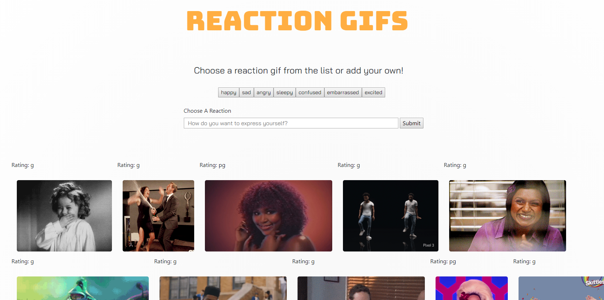
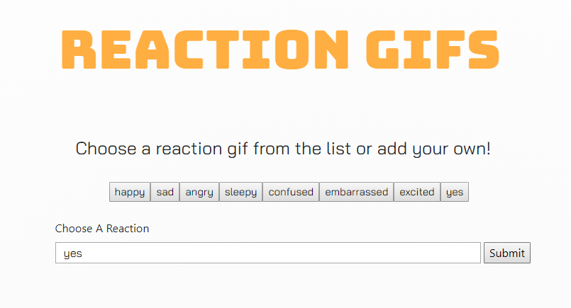
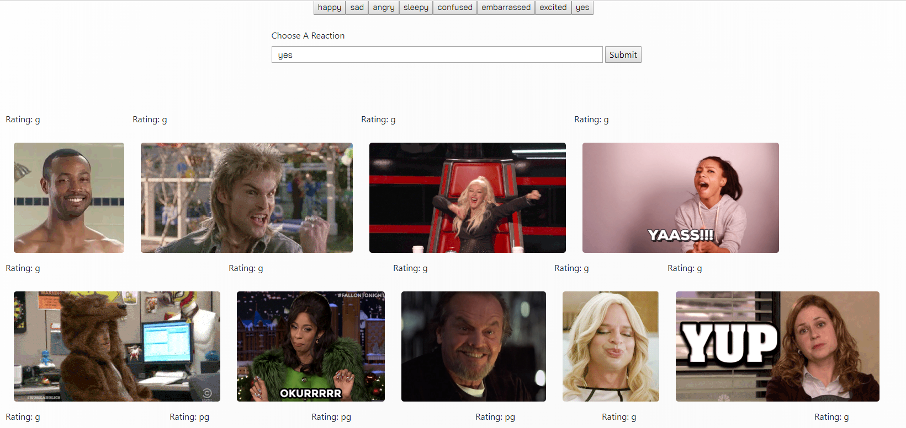

# Gify

Gify is the assignment that uses the GIPHY API to create a dynamic web page that populates with gtifs of your choice. 

The page has a series of buttons preassigned that the user can choose from 

or a button can be added by typing the desired term in the input and hitting enter.

Once the button is added the user can click it and the gif corresponding with that term will appear.

- - -

### Technology Used:

* JQuery
* GIPHY API
* Ajax - for api calls
* Bootstrap css 
* Custom - html, css, javascript
